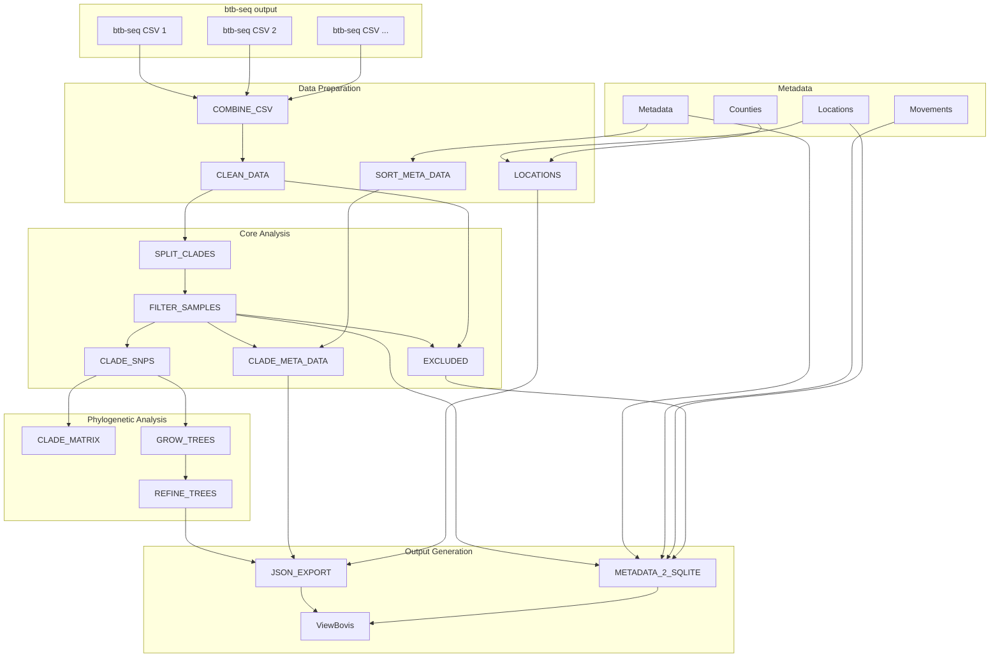

# **bTB-forestry**

`bTB-forestry` is APHA's nextflow pipeline for analysing phylogenies and SNP matrices for bovine TB, on a clade-by-clade basis.  It is inteneded as a follow on process to [btb-seq](https://github.com/APHA-CSU/btb-seq) and has been specifically designed around the outputs (summary csv and directory structure) from that pipeline. The outputs of btb-forestry are intended for use in [ViewBovis](https://github.com/APHA-CSU/ViewBovis).

**Quick start**
To run the pipeline with default settings:

`nextflow run APHA-CSU/btb-forestry`

Or with custom parameters:

`nextflow run APHA-CSU/btb-forestry \
    --pathTocsv "/path/to/btb-seq/results/**/*FinalOut*.csv" \
    --metadata "/path/to/metadata.csv" \
    --outdir "/path/to/output"`

**Pipeline overview**

The pipeline processes data through the following key stages:

1)  Data Preparation: Concatenates and cleans output CSV files from btb-seq runs
2)  Quality Filtering: Removes duplicates, retaining highest quality samples per submission
3)  Clade Separation: Splits samples by WGS cluster/clade for independent analysis
4)  SNP Analysis: Extracts polymorphic sites and calculates pairwise SNP distances
5)  Phylogeny: Generates maximum parsimony trees using MEGA
6)  Visualisation: Formats output for Nextstrain display

**Parameters**

    btb-forestry - Bovine TB Phylogenetic Analysis Workflow
    
    Usage:
        nextflow run main.nf [options]
    
    Options:
      --pathTocsv              Path to CSV files produced by btb-seq (default: /home/user/git/btb-forestry/**/*FinalOut*.csv)
      --metadata               Path to metadata CSV file (default: /home/user/git/btb-forestry/metadata.csv)
      --movements              Path to movements CSV file (default: /home/user/git/btb-forestry/movements.csv)
      --locations              Path to locations CSV file (default: /home/user/git/btb-forestry/locations.csv)
      --outdir                 Output directory (default: /home/user/git/btb-forestry)
      --homedir                Home directory (default: /home/guyoldrieve)
      --today                  Date string for output naming (default: 01Sep25)
      --prod_run               Production run mode - backs up existing data (default: false)
      --matrixdir              Directory for matrix copy (default: /home/user/git/btb-forestry/matrixcopy)
      --outliers               Path to outliers file (default: /home/user/git/btb-forestry/accessory/outliers.txt)
      --cladeinfo              Path to clade information CSV (default: /home/user/git/btb-forestry/accessory/CladeInfo.csv)
      --auspiceconfig          Auspice configuration JSON (default: /home/user/git/btb-forestry/accessory/auspice_config.json)
      --colours                Custom colours TSV file (default: /home/user/git/btb-forestry/accessory/custom-colours.tsv)
      --counties               Counties TSV file (default: /home/user/git/btb-forestry/accessory/counties.tsv)
      --maxP200x               MEGA analysis options file for MP 200x (default: /home/user/git/btb-forestry/accessory/infer_MP_nucleotide_200x.mao)
      --userMP                 MEGA analysis options file for user MP tree (default: /home/user/git/btb-forestry/accessory/analyze_user_tree_MP__nucleotide.mao)
      --help                   Print this help message
    
    Examples:
        nextflow run main.nf --pathTocsv "/data/**/*Results*.csv" 

**Dependencies**

The pipeline requires:

-   Nextflow (DSL2)
-   [snp-sites](https://github.com/sanger-pathogens/snp-sites) - SNP extraction
-   [snp-dists](https://github.com/tseemann/snp-dists) - Distance matrix calculation
-   [Megacc](https://www.megasoftware.net/) - Phylogenetic tree construction
-   [Nextstrain](https://docs.nextstrain.org/en/latest/index.html) - Outputs are formatted for display in Nextstrain
-   Python 3 with required packages for data processing

**Help**

For detailed parameter information:

**Integration with btb-seq**

This pipeline is designed to work seamlessly with outputs from the btb-seq pipeline. The expected input is the FinalOut.csv summary files that contain sample outcomes, WGS clusters (clades), and quality metrics.

**Validation and testing**

The pipeline includes automated testing via GitHub Actions to ensure reliability and reproducibility of phylogenetic analyses across different bovine TB clades.